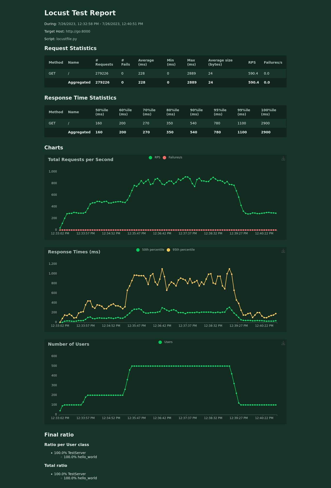
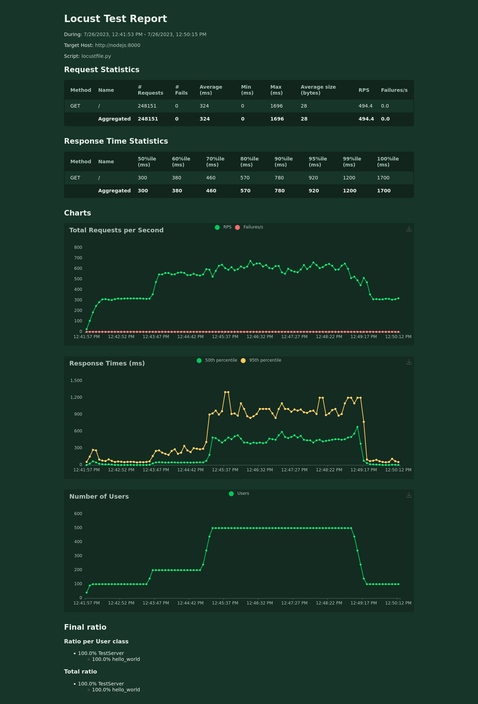
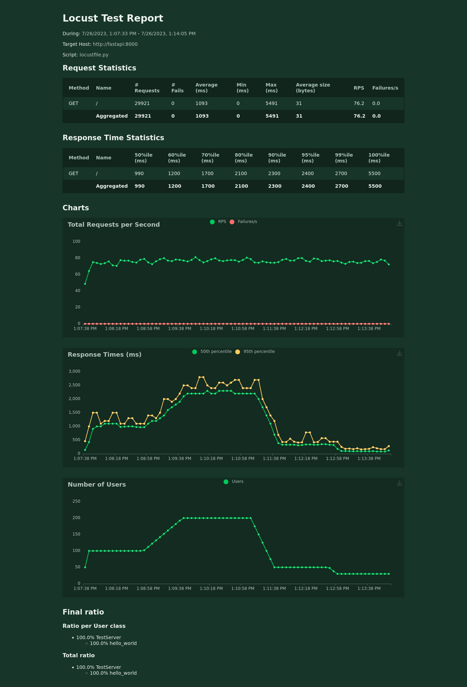
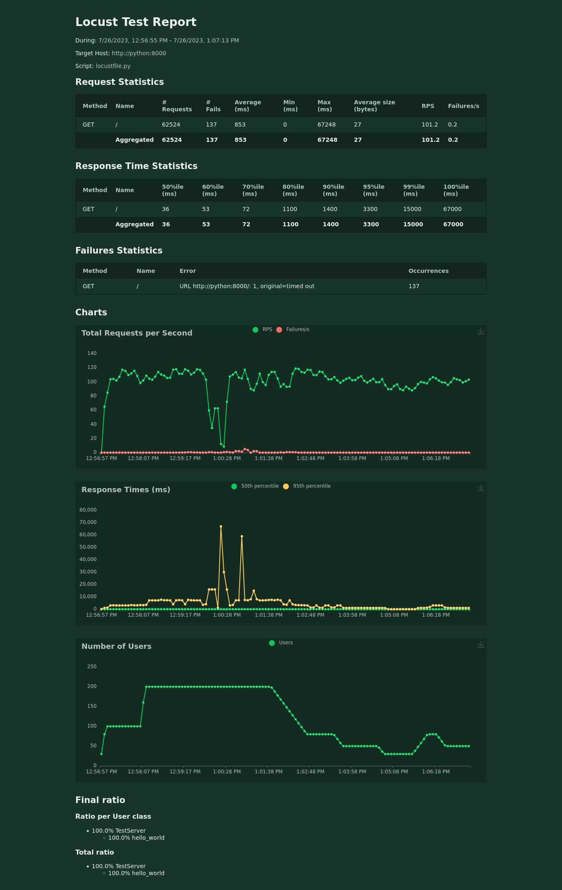

# benchmark with lotus

---
### red flag

**beware of the concurrent access to the same hardware. do not set absurdly high CPU values. always refer to the monitoring as the proof of truth:**
- **shared services must have CPU values far from the limit**
- **server must have CPU values close to the limit**

---

### deployment

lotus is already deployed with docker compose stack.

````bash
$ docker compose up -d
````
connect to locust => [localhost:8089](http://localhost:8089).

set the server.

| server(s) | url(s)              |
|-----------|---------------------|
| fastapi   | http://fastapi:8000 |
| go        | http://go:8000      |
| nodejs    | http://nodejs:8000  |
| python    | http://python:8000  |

---
define a load protocol. example:

````text
0. set 100 concurrent connexions
1. set stepping of 10 
2. define the host: http://python:8000 or http://fastapi:8000 or http://go:8000 or http://nodejs:8000
3. quick the bench
4. one minute later increases user connexions to 200
5. then 500 
6. wait the behavior becomes steady
7. then drop back 100
8. then stop the bench
````
---
for each load bench save the [stats/report](http://localhost:8089/stats/report) 

- `fastapi` => [report](./reports/report_fastapi.png)
- `go` => [report](./reports/report_go.png)
- `nodejs` => [report](./reports/report_nodejs.png)
- `python` => [report](./reports/report_python.png)


---

resources monitoring => [localhost:3000](http://localhost:3000/containers/docker)

---

the results are self-explanatory.


- go =>>



- nodejs =>>



- fastapi =>>



- python =>>
