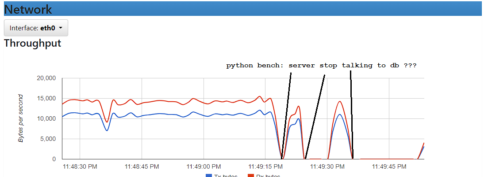
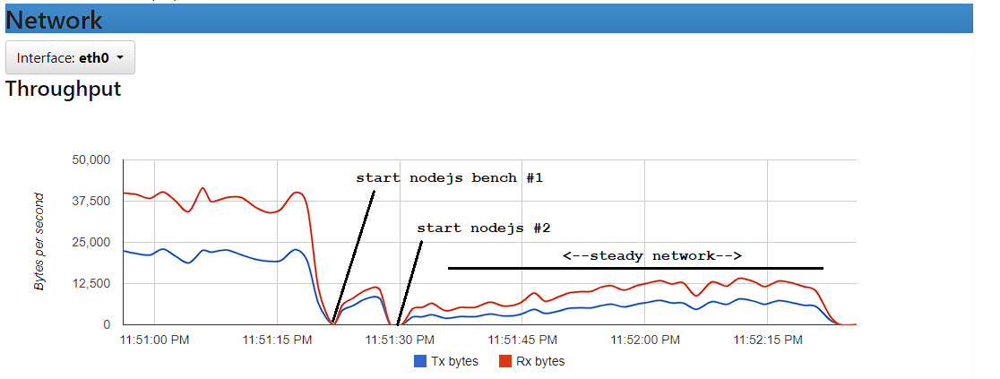

## benchmark bash

requires [bash](https://www.gnu.org/software/bash/).

run the benchmark:
````bash
## send 6000 requests to each server
$ bash bench/manual/run.sh
````
````output
#0: Test 'Python' Server (8000) with 5000 req, time = 68.600
#1: Test 'Fastapi' Server (8001) with 5000 req, time = 91.440
#2: Test 'Go' Server (8002) with 5000 req, time = 26.481
#3: Test 'NodeJs' Server (8003) with 5000 req, time = 43.741
````

````bash
## control # of runners and requests per runner
$ RUNNERS=100 REQUESTS=100 bash bench/manual/run.sh
````
````output
#0: Test 'Python' Server (8000) with 200 runners, time = 5.212
#1: Test 'Fastapi' Server (8001) with 200 runners, time = 5.303
#2: Test 'Go' Server (8002) with 200 runners, time = 5.276
#3: Test 'NodeJs' Server (8003) with 200 runners, time = 5.234
````

comments:
- this benchmark generates enough load to check the setup in the monitoring console.
- in the monitoring console we can spot on unusual patterns (see example below)
- the manual benchmark demonstrates Go > NodeJs > Python > Fastapi, but not very informative...
- we recommend to run the lotus benchmark for further investigation.

monitoring:

investigate thoroughly the monitoring to spot unusual behaviors. 

There is the networking between redis and python server. there is clearly an issue as the network collapse erratically during the load test for no clear reason.



This behavior is confirmed by cpu curve of the python server. that appears erratic as well.

In contrast =>>


